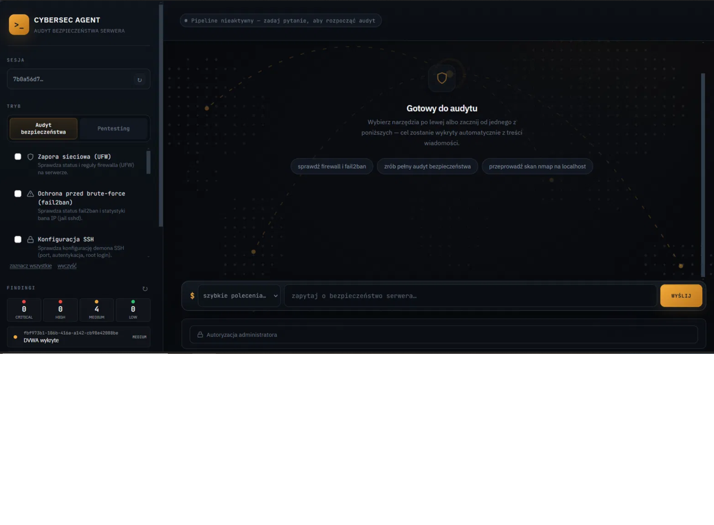
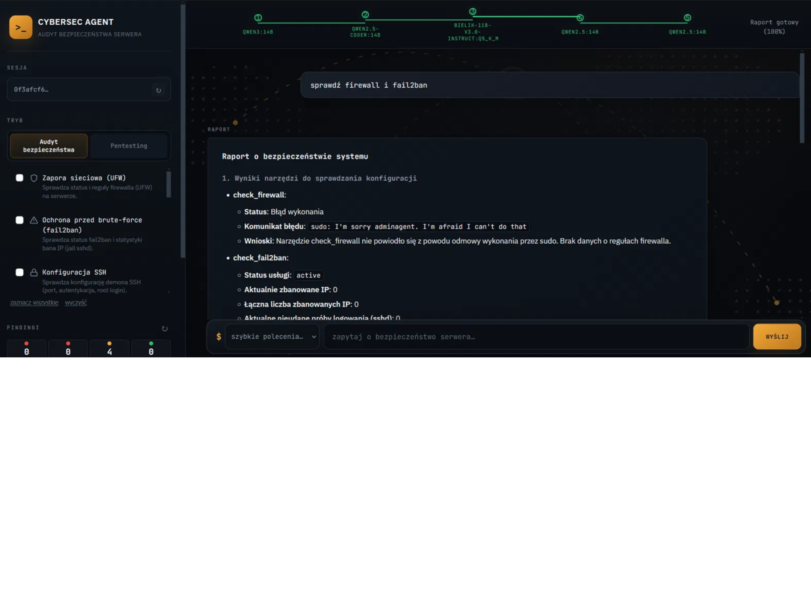
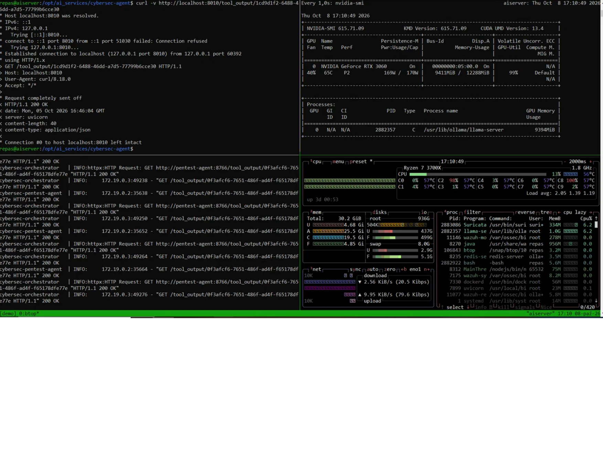
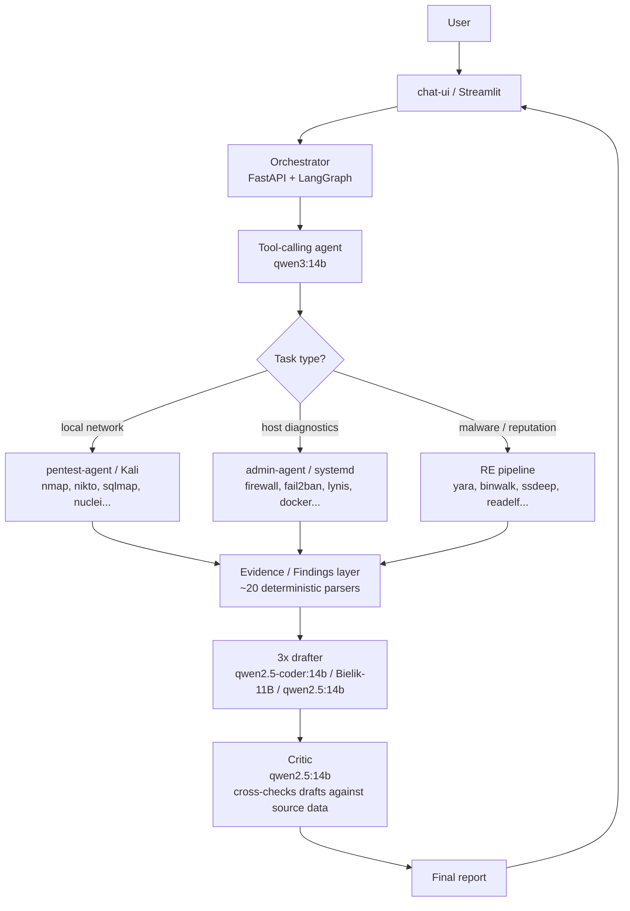

# Cybersec Agent

> 🇬🇧 English | [🇵🇱 Polski](README.pl.md)

**Multi-agent LLM pipeline for local-network security auditing and penetration testing, built on a deterministic-first architecture that keeps all technical facts out of the models' hands.**

> **Status:** development / portfolio project. Built and tested on self-hosted infrastructure (Docker + local Ollama models).

---

## Overview

A system that assists with security auditing and penetration testing of a local network, orchestrating a pipeline of locally hosted large language models.

The core architectural principle is **deterministic-first**: every technical fact (numbers, names, software versions, tool output) is extracted from raw data by deterministic Python code. The language models serve a purely editorial role — they organize, describe and formulate recommendations, but never interpret numerical data themselves.

This eliminates a whole class of errors caused by the documented tendency of LLMs to drop, distort or fabricate fragments of long technical output ("hallucinations"). This behavior was confirmed empirically and repeatedly during development — see [Fighting LLM hallucinations](#fighting-llm-hallucinations).

---

## Demo

> Screenshots from a live run on the author's self-hosted server (the machine it runs on is described under [Running](#running)).

**1. Ready state — pick tools on the left, or just describe the target in plain language.**



**2. Full pipeline run — five models, finished report.**

The cascade runs left to right (qwen3:14b → qwen2.5-coder:14b → Bielik-11B → qwen2.5:14b → qwen2.5:14b) and produces a structured report.



One detail worth calling out: when a tool genuinely fails, the report **records the failure** instead of inventing a result. In this run `check_firewall` was blocked by `sudo` (the command was not on the agent's allowlist), while `check_fail2ban` returned a real status:

```
check_firewall
  Status:  execution error
  Error:   sudo: command not permitted for adminagent
  Result:  no firewall data — the tool was blocked

check_fail2ban
  Status:         active
  Banned IPs:     0
  Failed logins:  0
```

That is the deterministic-first principle in practice — see [Fighting LLM hallucinations](#fighting-llm-hallucinations).

**3. It really runs — infrastructure under load.**

Orchestrator and pentest-agent talking over HTTP, a 14B model served on the GPU via Ollama, with Suricata and Wazuh running alongside on the host.



---

## Architecture



**Components:**
- **chat-ui (Streamlit)** — chat panel, tool/mode selection (audit / pentest), findings panel
- **Orchestrator (FastAPI + LangGraph)** — flow logic, ~20 deterministic data parsers, prompt building, cascaded model pipeline
- **pentest-agent** — runs offensive tools in an isolated environment, with a central tool registry and target validation (allowlist)
- **admin-agent** — host-side system service, diagnostics via a restricted (whitelisted) set of `sudo` commands
- **Evidence/Findings layer** — data model and persistent store for findings, full lifecycle: detection → validation → risk assessment → retest
- **Internal Sensor** — passive discovery of hosts on the local network

**Cascaded model pipeline:** 1 tool-calling agent (qwen3:14b) → 3 independent drafters writing report drafts in parallel → 1 critic model comparing drafts against source data and producing the final report.

---

## Fighting LLM hallucinations

During development, several independent, reproducible categories of LLM generation errors were empirically confirmed and solved when processing long, technical tool output:

1. **Data loss when transcribing firewall rules** — the model dropped/grouped entries despite explicit prompt instructions. *Solution:* deterministic parser + automatic completeness check in the critic layer.
2. **Data loss when transcribing system audit output (Lynis)** — same problem across dozens of warning/suggestion entries. *Solution:* same mechanism as for the firewall.
3. **Incorrect counting of executed tool calls** — the model reported a different number than actually ran. *Solution:* deterministic counter injected as a non-negotiable fact.
4. **Model generating text that looked like a tool call without actually executing it** — leading to a fully fabricated report about a critical vulnerability. *Solution:* pattern detection + hard block on describing results without a real tool execution.
5. **Skipping entire sections in multi-part audits** plus unexpected switching of the report language to English. *Solution:* deterministic section checklist.
6. **Fabricating non-existent execution errors** (HTTP codes, timeouts) despite a correct status field in the source data. *Solution:* deterministic execution-status parser.

Each case was observed on real data, documented in the source code, and addressed through the deterministic-first principle — not by further prompt tweaking.

---

## Tech stack

- **Backend:** Python 3.11, FastAPI, Pydantic
- **LLM orchestration:** LangGraph, LangChain (langchain-ollama)
- **Models (Ollama, local):** qwen3:14b (tool-calling agent), qwen2.5-coder:14b + Bielik-11B-v3.0-instruct:Q5_K_M + qwen2.5:14b (report drafters), qwen2.5:14b (critic/reviewer)
- **Infrastructure:** Docker, Docker Compose
- **Frontend:** Streamlit
- **Offensive tools:** sqlmap, gobuster, ffuf, nikto, enum4linux, nmap, hydra, wafw00f, whatweb, nuclei, searchsploit, testssl.sh, web_login
- **Host diagnostics:** ufw, fail2ban, systemd, Lynis, Wazuh, Suricata
- **RE / artifact analysis:** ssdeep (fuzzy hashing), YARA, binwalk, binutils (readelf/nm/objdump)
- **SAST:** Semgrep
- **External data:** MalwareBazaar (abuse.ch)
- **Storage:** file-based JSON artifacts per run + SQLite (users/sessions); Pydantic data model (RawResult, Observation, Evidence, Finding, Validation, RiskAssessment, RetestResult, Asset, Artifact)

---

## Testing

A regression suite under `regression_tests/` runs the pipeline against fixed scenarios and stores each run as JSON, so output can be compared across changes:

- **Versioned test cases** (`regression_tests/cases/*.yaml`) — port scan on localhost, stealth-scan and firewall-exposure detection, web fingerprinting against DVWA, and full host audits (SSH, fail2ban, updates, users).
- **Recorded runs** (`regression_tests/results/*.json`) — a kept history of pipeline output.
- **End-to-end validation** against deliberately vulnerable targets: OWASP Juice Shop, DVWA and HackTheBox "easy" machines.

```
python regression_tests/run_tests.py
```

---

## Running

This is a multi-service, self-hosted system — **not a one-command demo**. It expects a capable GPU host, locally served models, and a separately provisioned host agent. The snippet below is how it is deployed, not a laptop quickstart.

```
git clone https://github.com/s40914/Cybersec-agent.git
cd Cybersec-agent
cp .env.example .env   # fill in tokens (PENTEST_AGENT_TOKEN, ADMIN_AGENT_TOKEN)
docker compose up -d --build
```

**What it actually needs:**
- **A GPU host for the models.** Reference machine: Ryzen 7 3700X, 30 GB RAM, NVIDIA RTX 3060 12 GB. Models are served locally by Ollama; a single 14B model already uses ~9.5 GB of VRAM, so models are loaded on demand rather than all at once.
- **Local Ollama** serving the models listed under [Tech stack](#tech-stack).
- **The containers** — orchestrator (FastAPI/uvicorn) and pentest-agent (Kali toolbox) — come up via Docker Compose and talk over the internal network.
- **A separately provisioned `admin-agent`** host service (systemd) that runs host diagnostics through a whitelisted set of `sudo` commands. Host-hardening checks fail by design when a command is not on that allowlist.

**Not included / not production-ready:** see [Known limitations & roadmap](#known-limitations--roadmap).

---

## Known limitations & roadmap

This is a portfolio/development project, not production-ready. Key items on the roadmap (from an internal code review for production-readiness): per-tenant data isolation, encryption at rest, data retention policy, wiring all tools into the Findings engine (currently a subset), persistent pipeline checkpointing, and deployment hardening (TLS, secrets, resource limits).

---

## Author

Michał Budyńczuk
