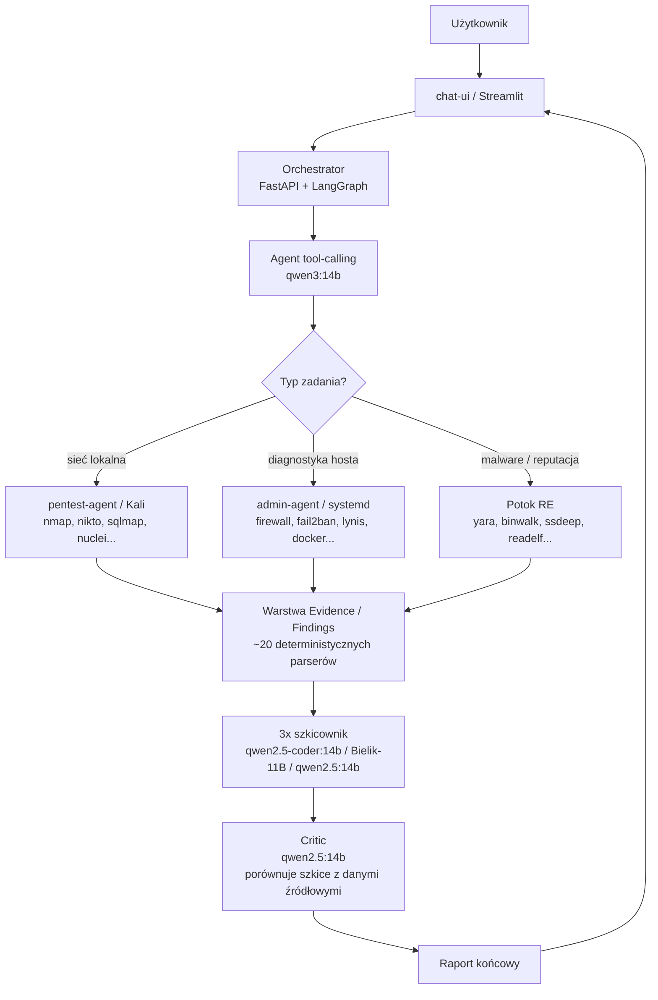

# Cybersec Agent

> [🇬🇧 English](README.md) | 🇵🇱 Polski

**Wieloagentowy potok LLM do audytu bezpieczeństwa i testów penetracyjnych sieci lokalnej, zbudowany na architekturze „deterministic-first" — wszystkie fakty techniczne pochodzą z deterministycznego kodu, nie z modeli.**

> **Status:** projekt rozwojowy / portfolio. Zbudowany i testowany na własnej infrastrukturze (Docker + lokalne modele Ollama).

---

## Cel i założenia projektu

System wspomagający audyt bezpieczeństwa oraz testy penetracyjne sieci lokalnej, oparty o wieloagentowy potok przetwarzania (pipeline) wykorzystujący lokalnie hostowane modele językowe (LLM).

Głównym założeniem architektonicznym jest zasada **„deterministic-first"**: wszystkie fakty techniczne (liczby, nazwy, wersje oprogramowania, wyniki narzędzi diagnostycznych) są wyodrębniane z danych surowych przez deterministyczny kod w języku Python, natomiast modele językowe pełnią wyłącznie rolę redakcyjną — porządkują, opisują i formułują rekomendacje, nie interpretując samodzielnie danych liczbowych.

Podejście to eliminuje klasę błędów wynikającą z udokumentowanej tendencji modeli językowych do pomijania, zniekształcania lub zmyślania fragmentów danych przy przetwarzaniu długich, technicznych wyników narzędzi bezpieczeństwa (tzw. halucynacje). Zjawisko to zostało w projekcie potwierdzone empirycznie i wielokrotnie — patrz [Walka z halucynacjami LLM](#walka-z-halucynacjami-llm).

---

## Architektura systemu



**Komponenty:**
- **chat-ui (Streamlit)** — panel czatu, wybór narzędzi i trybu (audyt / pentesting), panel findingów
- **Orchestrator (FastAPI + LangGraph)** — logika przepływu, ok. 20 deterministycznych parserów danych, budowa promptów, kaskadowy potok modeli
- **pentest-agent** — wykonywanie narzędzi ofensywnych w izolowanym środowisku, z centralnym rejestrem narzędzi i walidacją celu (allowlist)
- **admin-agent** — usługa systemowa na hoście, diagnostyka przez ograniczony (whitelistowany) dostęp do poleceń `sudo`
- **Warstwa Evidence/Findings** — model danych i magazyn trwały dla ustaleń bezpieczeństwa, pełny cykl życia: wykrycie → walidacja → ocena ryzyka → retest
- **Internal Sensor** — pasywne wykrywanie hostów w sieci lokalnej

**Kaskadowy potok modeli:** 1 agent tool-calling (qwen3:14b) → 3 niezależne szkicowniki piszące szkice raportu równolegle → 1 model-recenzent (*critic*) porównujący szkice z danymi źródłowymi i tworzący raport końcowy.

---

## Walka z halucynacjami LLM

W trakcie rozwoju projektu empirycznie potwierdzono i rozwiązano kilka niezależnych, powtarzalnych kategorii błędów generowania tekstu przez modele językowe przy przetwarzaniu długich, technicznych wyników narzędzi:

1. **Utrata danych przy transkrypcji reguł zapory sieciowej (firewall)** — model gubił/grupował pozycje mimo jawnej instrukcji w prompcie. *Rozwiązanie:* deterministyczny parser + automatyczna weryfikacja kompletności w warstwie recenzenta.
2. **Utrata danych przy transkrypcji wyniku audytu systemowego (Lynis)** — analogiczny problem przy dziesiątkach pozycji ostrzeżeń/sugestii. *Rozwiązanie:* analogiczny mechanizm jak dla firewalla.
3. **Błędne zliczanie liczby wykonanych wywołań narzędzi** — model deklarował inną liczbę niż faktyczna. *Rozwiązanie:* deterministyczny licznik wstrzykiwany jako niepodważalny fakt.
4. **Model generujący tekst wyglądający jak wywołanie narzędzia, bez faktycznego wykonania** — prowadzące do w pełni zmyślonego raportu o krytycznej podatności. *Rozwiązanie:* wykrywanie wzorca + twarda blokada opisu wyników bez faktycznego wykonania narzędzia.
5. **Pomijanie całych sekcji przy audycie wieloczęściowym** oraz nieoczekiwane przełączenie języka raportu na angielski. *Rozwiązanie:* deterministyczna lista kontrolna sekcji.
6. **Zmyślanie nieistniejących błędów wykonania** (kody HTTP, przekroczenie limitu czasu) mimo poprawnego pola statusu w danych źródłowych. *Rozwiązanie:* deterministyczny parser statusu wykonania.

Każdy z powyższych przypadków został zaobserwowany na rzeczywistych danych, udokumentowany w kodzie źródłowym i zaadresowany przez zasadę „deterministic-first" — nie przez dalsze poprawianie treści promptu.

---

## Wykorzystane technologie

- **Backend:** Python 3.11, FastAPI, Pydantic
- **Orkiestracja LLM:** LangGraph, LangChain (langchain-ollama)
- **Modele (Ollama, lokalnie):** qwen3:14b (agent narzędziowy / tool-calling), qwen2.5-coder:14b + Bielik-11B-v3.0-instruct:Q5_K_M + qwen2.5:14b (szkicownicy raportu), qwen2.5:14b (recenzent / critic)
- **Infrastruktura:** Docker, Docker Compose
- **Frontend:** Streamlit
- **Narzędzia ofensywne:** sqlmap, gobuster, ffuf, nikto, enum4linux, nmap, hydra, wafw00f, whatweb, nuclei, searchsploit, testssl.sh
- **Diagnostyka hosta:** ufw, fail2ban, systemd, Lynis, Wazuh, Suricata
- **Reverse engineering / analiza artefaktów:** ssdeep (fuzzy hashing), YARA, binwalk, binutils (readelf/nm/objdump)
- **SAST:** Semgrep
- **Zewnętrzne źródła danych:** MalwareBazaar (abuse.ch)
- **Magazyn danych:** plikowe artefakty JSON per uruchomienie + SQLite (użytkownicy/sesje); model danych Pydantic (RawResult, Observation, Evidence, Finding, Validation, RiskAssessment, RetestResult, Asset, Artifact)

---

## Jak uruchomić

```
git clone https://github.com/s40914/Cybersec-agent.git
cd Cybersec-agent
cp .env.example .env   # uzupełnić tokeny (PENTEST_AGENT_TOKEN, ADMIN_AGENT_TOKEN)
docker compose up -d --build
```

**Wymagania:**
- Docker + Docker Compose
- Lokalny serwer Ollama z pobranymi modelami (patrz sekcja *Technologie*)
- Osobno skonfigurowana usługa `admin-agent` na hoście (systemd) — diagnostyka hosta wymaga uprawnień `sudo` do wybranych, whitelistowanych poleceń

---

## Znane ograniczenia i dalsze prace

To projekt rozwojowy / portfolio, nie wersja produkcyjna. Kluczowe pozycje na mapie drogowej (z wewnętrznego przeglądu kodu pod kątem gotowości produkcyjnej): izolacja danych per klient/tenant, szyfrowanie danych at-rest, polityka retencji danych, podłączenie wszystkich narzędzi do silnika Findings (obecnie podzbiór), trwały checkpointing stanu pipeline'u oraz hardening wdrożeniowy (TLS, sekrety, limity zasobów).

---

## Autor

Michał Budyńczuk
